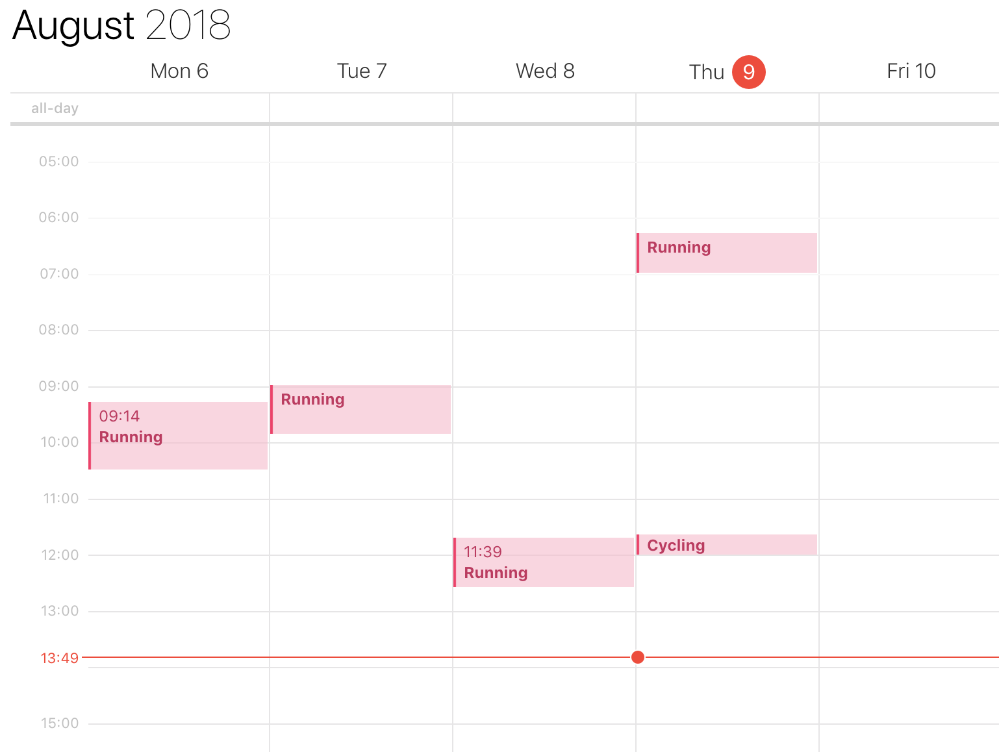

This is a quick prototype that creates calendar entries for HealthKit Workouts (as created by Apple Watch Workouts) - normally looked at through the excellent Activity App.
The idea is to offer a simple way to see *when* you worked out, alongside other day-to-day events in your calendar.

You definitely want to create a new Calendar for this. First, because then you can easily hide all the events. And secondly, because the app is most likely buggy and if something goes wrong you can just delete that whole calendar.
This was all cobbled together in a hackathon-style way. I might clean it up later... maybe. I did this with as close to zero planning and architecture as possible. It's all about as lazy as it gets and there's zero error handling. So yeah, it's quite terrible. Don't judge me!

License: MIT
